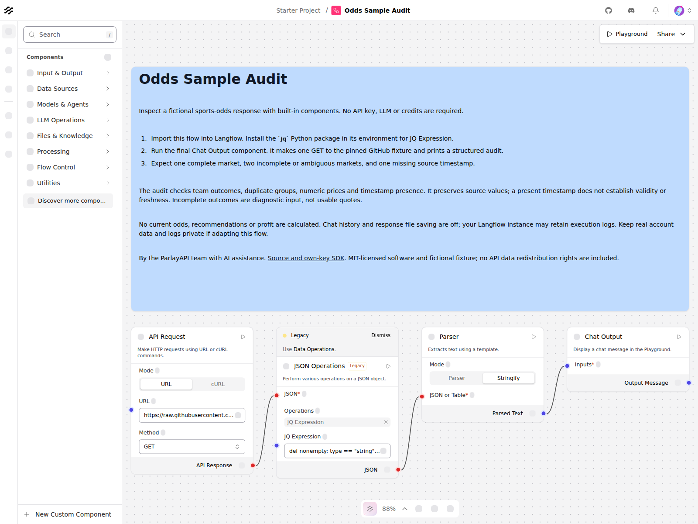

# Odds Sample Audit for Langflow

A four-component workflow that inspects a fictional odds response before it is used elsewhere. It makes one GET to a pinned GitHub fixture, checks market completeness and source timestamp presence, and prints a structured report. No API key, LLM, or credits are required.

Download the [flow JSON](https://raw.githubusercontent.com/JacobiusMakes/parlay-api-python/25e00d0448136db72f9d8a6601e8b54dcde8f54a/examples/langflow/Odds%20Sample%20Audit.json) and import it into Langflow. The built-in JSON Operations component uses JQ Expression, which requires `jq` in your Langflow Python environment. Run the final Chat Output component. The fixture intentionally produces:

- 1 complete market with both team outcomes.
- 2 incomplete or ambiguous markets, including duplicate market groups.
- 1 missing source timestamp.

The JSON Operations query is visible in the editor. It preserves the supplied prices and timestamps. A timestamp being present does not mean it is valid or current. The outcome lists on incomplete groups are diagnostic input, not usable quotes. This flow calculates no betting edge, recommendations, or profit.

Chat message storage and response file saving are disabled. Langflow may retain other execution logs according to the instance's configuration. Keep real data and logs private if you adapt this workflow.

The fixture contains fictional teams, bookmakers, prices, and dates. It is MIT-licensed teaching data, not a sample of current ParlayAPI coverage. For a separate own-key workflow, see the [ParlayAPI Python SDK](https://github.com/JacobiusMakes/parlay-api-python). Software licensing does not include API data redistribution rights or amend customer agreements.

Validated in published Langflow 1.12.0: native import, editor rendering and execution pass, including the expected counters and exact source values. Sixteen metadata/query/graph tests and seven harness tests also pass. See the [hosted validation run](https://github.com/JacobiusMakes/parlay-api-python/actions/runs/34070155028). Langflow 1.13 runtime execution has not been tested.

The embedded built-in component definitions come from [Langflow v1.12.0](https://github.com/langflow-ai/langflow/tree/v1.12.0), under its MIT license included in `UPSTREAM-LICENSE.txt`. The fixture URL is pinned to its source commit.
